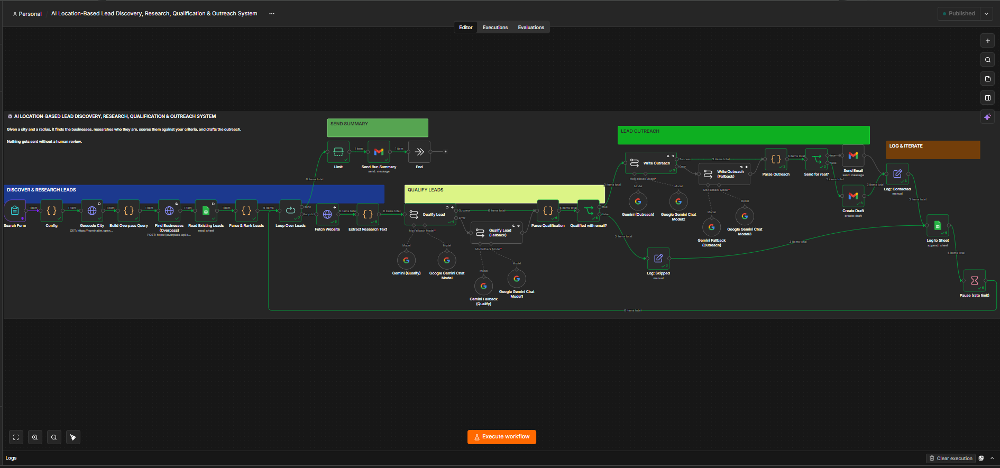
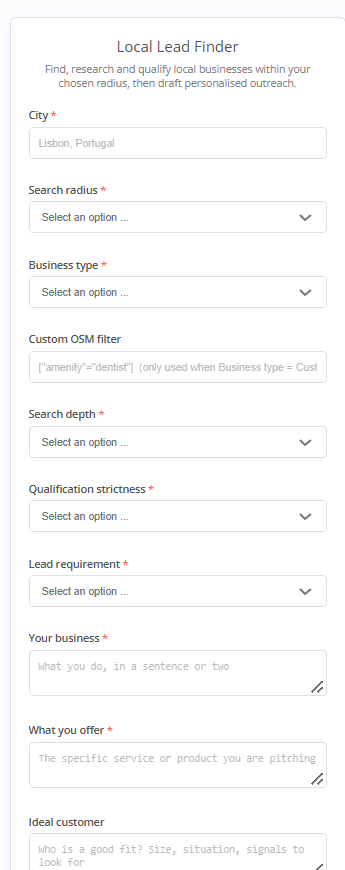
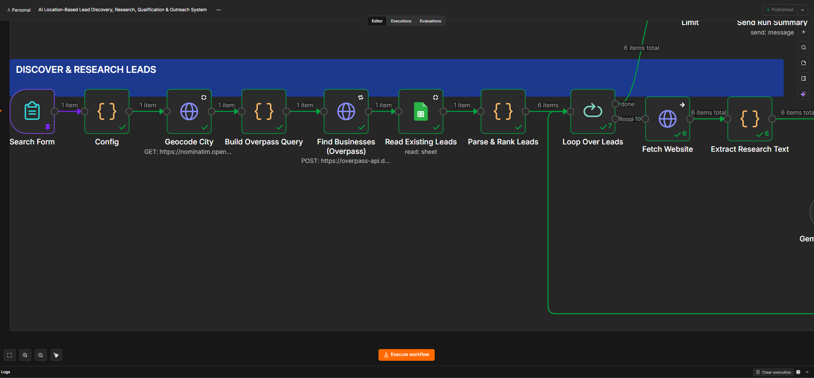
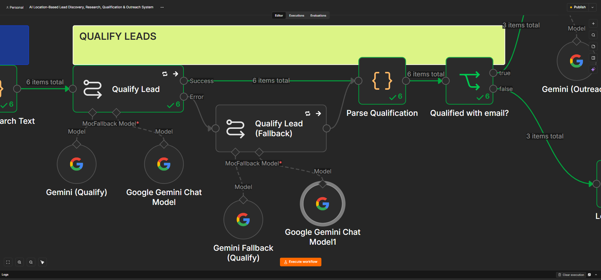
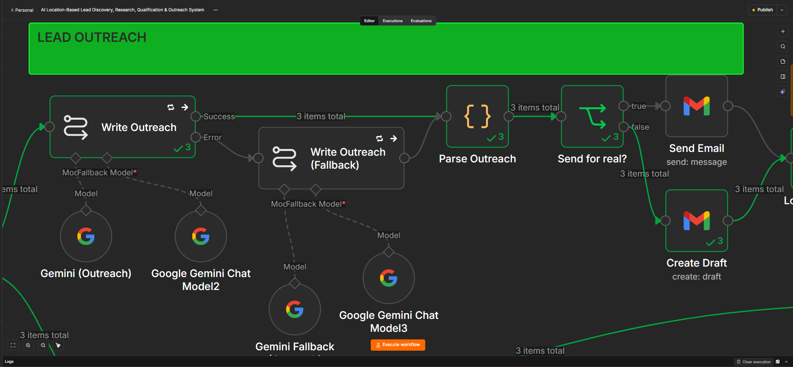
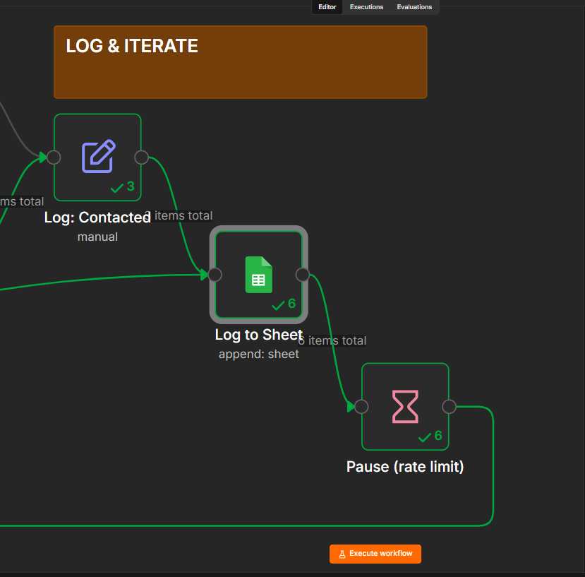
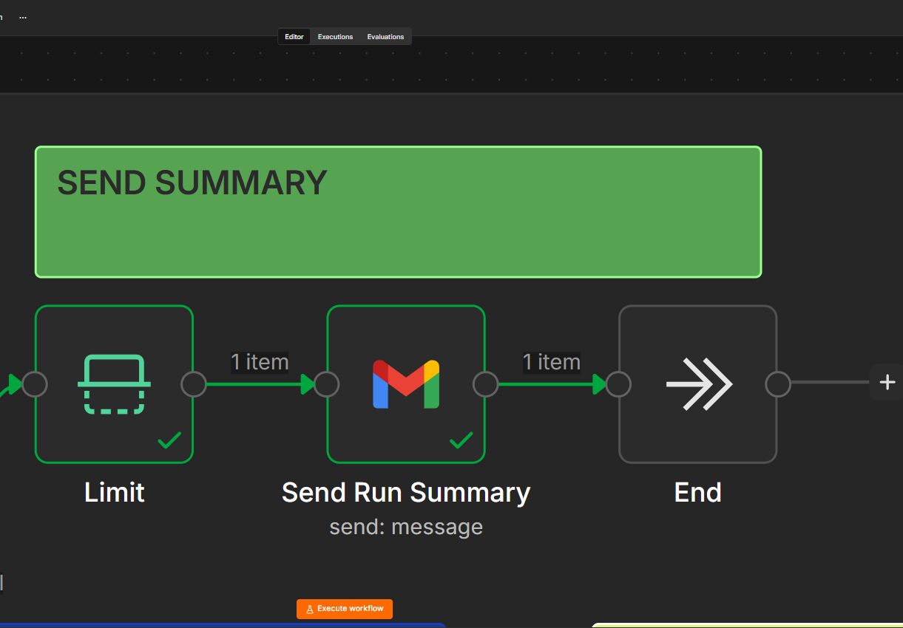
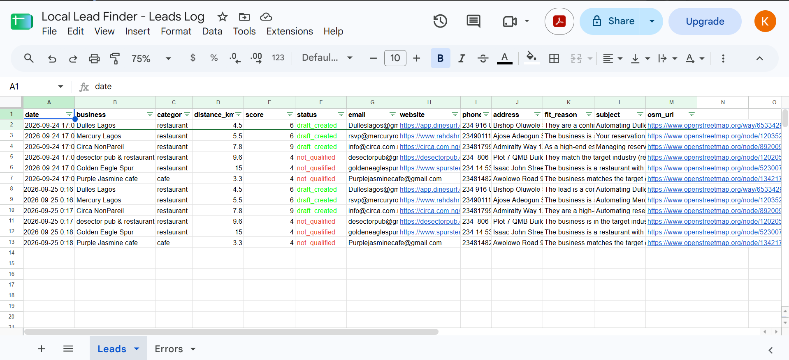
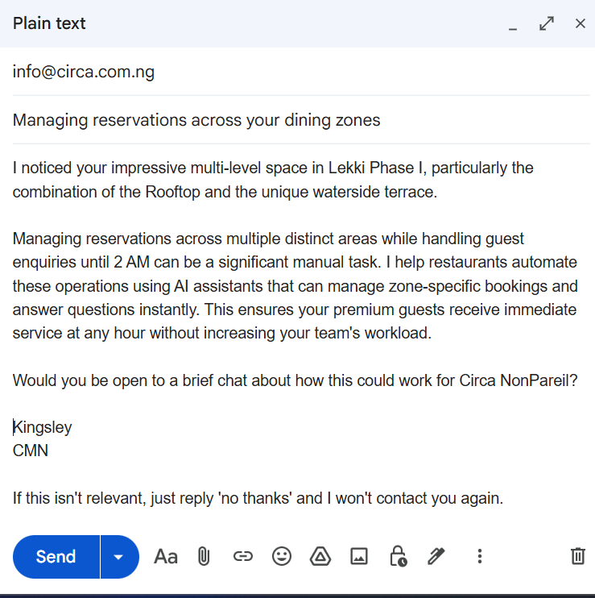
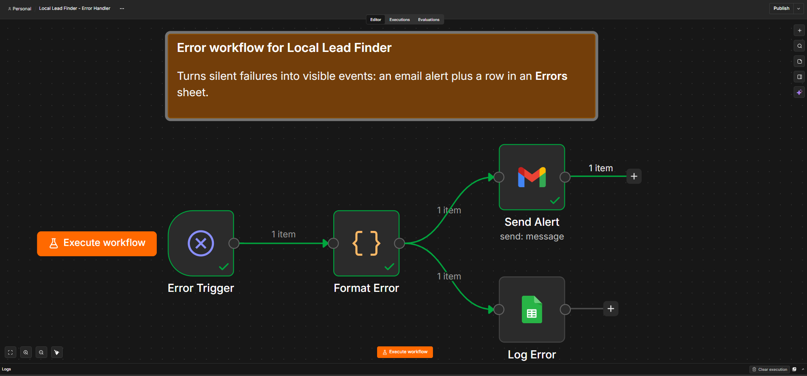

# AI Location-Based Lead Discovery, Research, Qualification & Outreach System

An n8n workflow that finds local businesses within a city and radius, researches each one from its website, scores it against your ideal customer profile, and drafts (or optionally sends) a personalized first-touch email — with a human review step before anything goes out.

Built with n8n, OpenStreetMap (Nominatim + Overpass API), Google Gemini, Gmail, and Google Sheets.

## How it works

1. **Discover** — You submit a form with a city, radius, and business type. The workflow geocodes the city and queries OpenStreetMap's Overpass API for matching businesses.
2. **Research** — For each lead, it fetches the business website and extracts contact details, title, description, and body text.
3. **Qualify** — An LLM (Gemini) scores each lead against your business, offer, and ideal customer description, and explains its reasoning.
4. **Outreach** — Qualified leads with a usable contact email get a short, personalized email drafted by the LLM — created as a Gmail draft by default, or sent automatically if you opt in.
5. **Log & iterate** — Every lead (qualified or not) is logged to a Google Sheet, so re-running the workflow later skips businesses you've already processed.
6. **Summary** — You get an email when the run finishes, summarizing how many leads were processed.

A companion **error handler workflow** catches failures anywhere in the process and sends an alert email plus a row in an Errors sheet, so nothing fails silently.

## Screenshots

### Full workflow canvas

### 1. Intake form
The form used to kick off a search run — city, radius, business type, qualification strictness, and your outreach details.

### 2. Discover & research leads
Geocoding, the Overpass API query, and website scraping/contact extraction.

### 3. Qualify leads
The LLM scoring step, with a fallback model in case the primary call fails.

### 4. Lead outreach
Drafting the personalized outreach email based on the qualification output.

### 5. Log & iterate
Writing results to Google Sheets and looping back to the next lead, with a rate-limit pause between requests.

### 6. Run summary
The email sent once a run completes.

### Sample outputs
A sanitized row from the Leads sheet, and a sample Gmail draft produced by the workflow.

### Error handler workflow
Catches failures from the main workflow and turns them into an alert email + logged row.

## Files in this repo

| File | Description |
|---|---|
| `lead-finder-workflow-sanitized.json` | The main lead discovery, research, qualification, and outreach workflow. |
| `lead-finder-error-handler-sanitized.json` | The error handler workflow — import and set as the main workflow's error workflow. |

> Both files are sanitized: credential references are placeholders and need to be reconnected after import. No personal data, API keys, or sheet IDs are included.

## Prerequisites

- A self-hosted or cloud n8n instance
- A Google account with:
  - Gmail OAuth2 access (for drafting/sending outreach and error alerts)
  - Google Sheets OAuth2 access (for logging leads and errors)
- A Google Gemini API key (via Google AI Studio / Google PaLM API credential in n8n)
- A Google Sheet with two tabs: `Leads` and `Errors` (see schema below)

## Setup

1. **Import the workflows**
   In n8n, go to *Workflows → Import from File* and import both `lead-finder-workflow-sanitized.json` and `lead-finder-error-handler-sanitized.json`.

2. **Reconnect credentials**
   Each node that references a credential (Gmail, Google Sheets, Gemini) will show as disconnected. Open each one and select or create your own credential. There are multiple Gemini nodes (primary + fallback per step) — they can all point to the same credential.

3. **Create your Google Sheet**
   Create a Google Sheet with two tabs:
   - `Leads` with columns: `date, business, category, distance_km, score, status, email, website, phone, address, fit_reason, subject, osm_url`
   - `Errors` with columns: `time, workflow, failed_node, message, execution_id, execution_url, mode`

   Copy the sheet's ID from its URL (the long string between `/d/` and `/edit`) and paste it into the `documentId` field of every Google Sheets node in both workflows (`Log to Sheet`, `Read Existing Leads`, `Log Error`).

4. **Set the alert email**
   In the error handler workflow, open the `Send Alert` node and replace the placeholder with the email address you want failure alerts sent to.

5. **Link the error workflow**
   In the main workflow's settings, set *Error Workflow* to the imported error handler workflow so failures are automatically routed to it.

6. **Activate**
   Both workflows are imported as inactive. Activate the main workflow once credentials and the sheet are configured. The error handler doesn't need a trigger of its own — it runs on the main workflow's failures.

## Usage

Open the form trigger's production URL and fill in:

- **City** — e.g. `Lisbon, Portugal`
- **Search radius** — 5 to 50 km
- **Business type** — a preset category, or `Custom` with your own OpenStreetMap filter (e.g. `["amenity"="dentist"]`)
- **Search depth** — how many leads to process per run (10, 25, or 50)
- **Qualification strictness** — the minimum score (out of 10) a lead needs to be considered qualified
- **Lead requirement** — whether a website, an email, or either is required to count as a lead
- **Your business / What you offer / Ideal customer** — context the LLM uses to score and pitch leads
- **Outreach mode** — create Gmail drafts (recommended) or send automatically

By default, **nothing is sent without review** — outreach mode defaults to drafts only.

## Notes & limitations

- Uses OpenStreetMap data (via Nominatim and Overpass), so lead coverage and contact info completeness depends on how well businesses are mapped in your target area.
- Website scraping is best-effort; sites that block bots, require JavaScript rendering, or have no visible email will be skipped or scored conservatively.
- The workflow deduplicates against your `Leads` sheet, so re-running the same city/business type won't reprocess businesses already logged.
- LLM outputs (scores, summaries, email drafts) are generated content — review before sending, especially in "Send emails automatically" mode.
